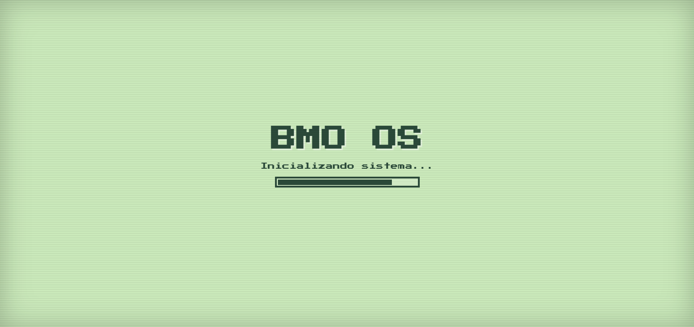
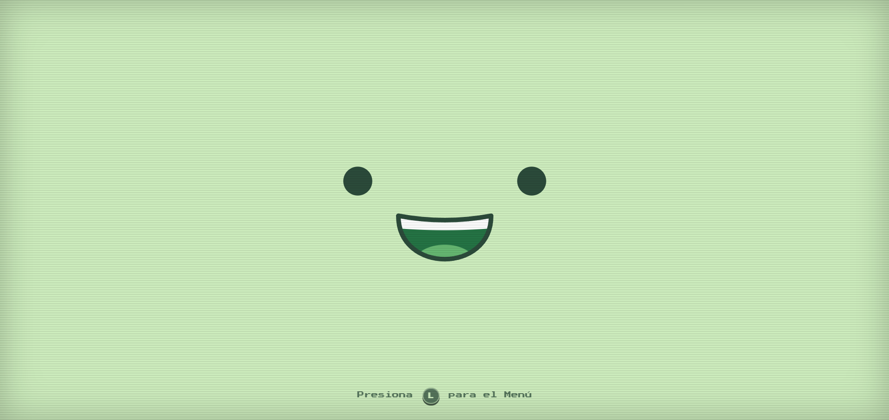
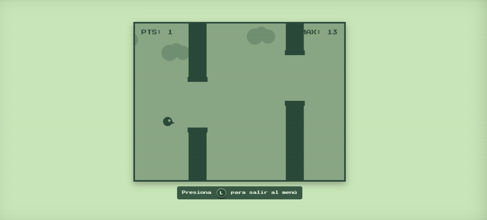
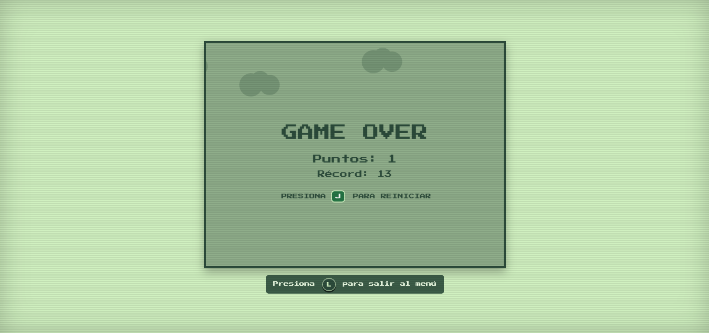
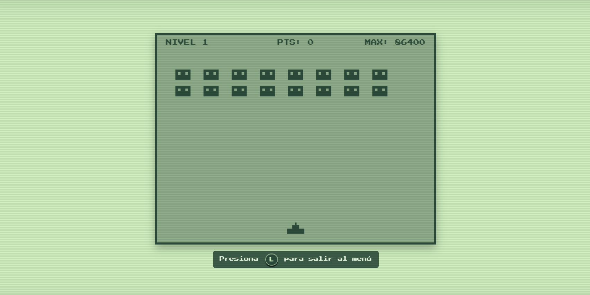
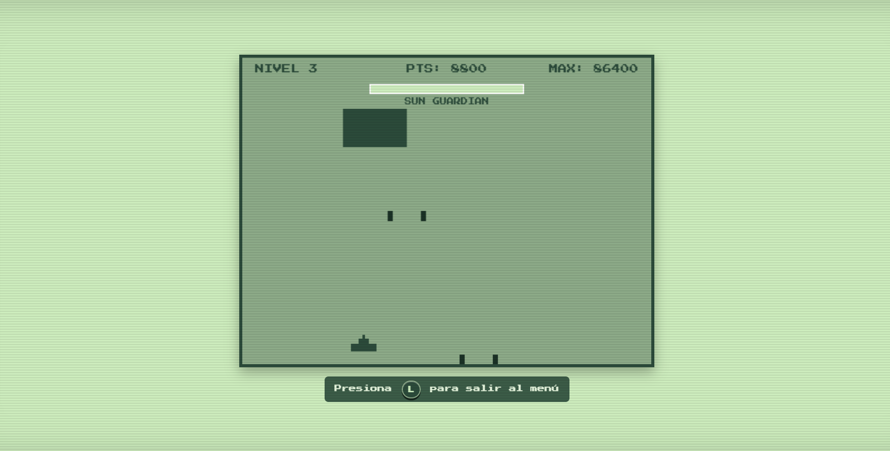
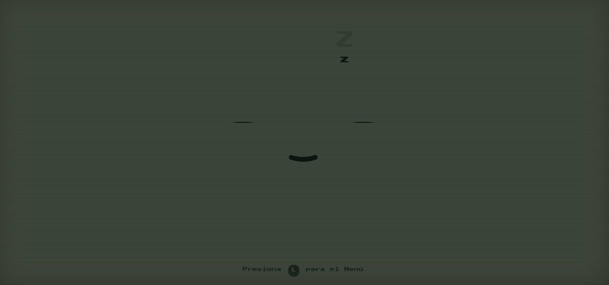

# BMO OS (Español) - Recreación Interactiva Web

Una recreación interactiva de la interfaz de BMO de Hora de Aventura construida para la web con HTML, CSS3, JavaScript Vanilla y GSAP.

Contiene efectos de audio con frases reales en español, expresiones animadas, reacciones por puntaje, teatro de emociones y 5 minijuegos retro integrados con soporte para teclado y mandos (Xbox, PlayStation, Nintendo Switch y mandos USB).

---

## Características Principales

- **Expresiones e Interactividad**: Animaciones faciales suaves utilizando GSAP para estados de inactividad, habla y emociones.
- **Audio en Español**: Sincronización labial al reproducir frases icónicas de BMO.
- **Soporte de Mandos y Teclado**: Detección automática en tiempo real con guías de botones adaptativas (Teclado, Xbox, PlayStation, Switch y USB).
- **Minijuegos Retro Integrados**:
  1. Snake BMO
  2. BMO Fly
  3. BMO Pac-Man
  4. Guardians of Sunshine
  5. BMO Pong
- **Modo Sueño y Guardado de Récords**: Estado de ahorro de energía y persistencia local de puntuaciones máximas.

---

## Controles

| Acción | Teclado | Mando Xbox / USB | PlayStation | Nintendo Switch |
| :--- | :---: | :---: | :---: | :---: |
| **Navegación** | W / A / S / D / Flechas | D-Pad / Stick Izquierdo | D-Pad / Stick Izquierdo | D-Pad / Stick Izquierdo |
| **Aceptar / Acción** | J / Espacio / Enter | A | ✕ | A |
| **Atrás / Cancelar** | K / Backspace | B | ◯ | B |
| **Menú Principal** | L | START | OPTIONS | + |

---

## Capturas del Proyecto

### Pantalla de carga


### Cara de BMO


### Menú general


### BMO Fly


### Pantalla de Game Over


### Pacman


### Los Guardianes


### Los Guardianes (Jefe final)


### BMO dormido


---

## Instalación y Ejecución

1. Clonar el repositorio:
   ```bash
   git clone https://github.com/k100fuegos/BMO.git
   ```
2. Abrir `index.html` en un navegador web.
3. Presionar cualquier tecla o hacer clic en la pantalla para iniciar.
