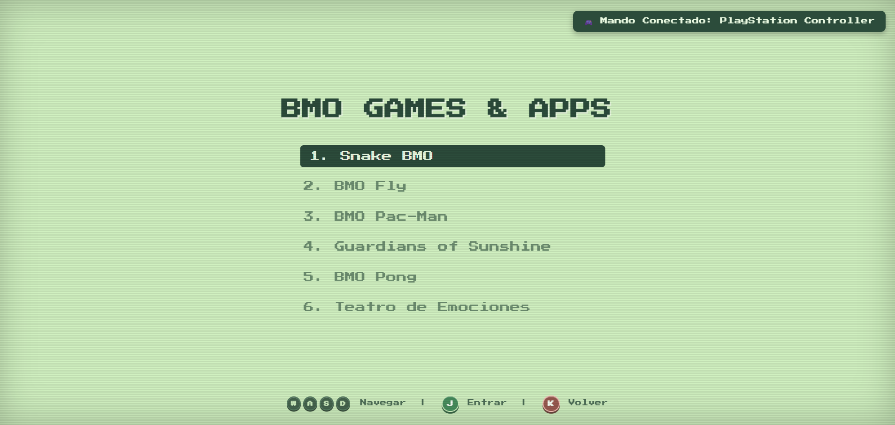
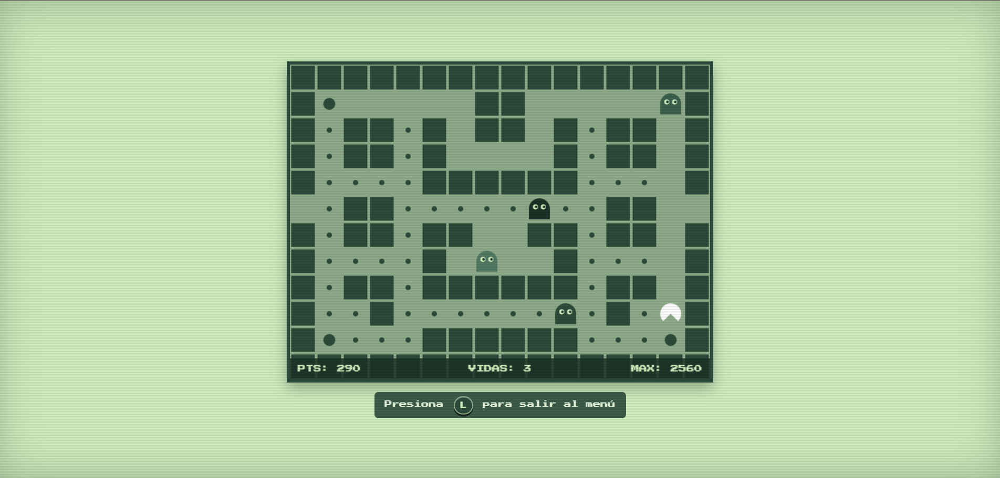

# 🤖 BMO OS (Español) - Recreación Interactiva Web

Una recreación interactiva de la pantalla y consola de **BMO (Hora de Aventura)** construida para la web con HTML, CSS3, JavaScript Vanilla y GSAP.

Contiene efectos de sonido, voces reales en español, animaciones expresivas, teatro de emociones y 5 minijuegos retro integrados con soporte completo para teclado y mandos arcade / consolas (Xbox, PlayStation, Nintendo Switch y Mandos USB).

---

## 🎮 Características Principales

- 🤖 **BMO Interactivo**: Expresiones animadas con físicas suaves mediante GSAP.
- 🗣️ **Voces Oficiales en Español**: Sincronización labial dinámica de la boca al hablar con frases icónicas de BMO (*"¡Sí BMO!"*, *"Risa qué loco"*, *"Hola familia"*, *"Asalto"*, *"Tu eres mi abuelito"*, *"Pequeño chiste"*, etc.).
- 🕹️ **Soporte de Mandos y Teclado en Tiempo Real**:
  - Detección automática y guías de botones 3D dinámicas en pantalla según el dispositivo activo (**Teclado**, **Xbox**, **PlayStation**, **Nintendo Switch**, **Mando USB**).
  - Efectos de vibración (*Haptic Feedback*) para mandos compatibles.
- 👾 **5 Minijuegos Retro Incluidos**:
  1. **Snake BMO**: El clásico juego de la serpiente ajustado con la paleta retro de BMO.
  2. **BMO Fly**: Esquiva tuberías y surca los cielos.
  3. **BMO Pac-Man**: Come laberintos con 4 fantasmas (*Blinky*, *Pinky*, *Inky* y *Clyde*).
  4. **Guardians of Sunshine**: Enfréntate a los tres guardianes y vence al jefe final.
  5. **BMO Pong**: Desafía a la IA de BMO en una partida de Pong.
- 🎭 **Teatro de Emociones**: Selecciona y activa cualquier expresión o baile de BMO.

---

## 🕹️ Controles

| Acción | Teclado | Mando Xbox / USB | PlayStation | Nintendo Switch |
| :--- | :---: | :---: | :---: | :---: |
| **Navegación (D-Pad)** | `W` `A` `S` `D` / `Flechitas` | `D-Pad` / `Stick Izq` | `D-Pad` / `Stick Izq` | `D-Pad` / `Stick Izq` |
| **Botón A (Entrar / Acción)** | `J` / `Espacio` / `Enter` | `A` | `✕` | `A` |
| **Botón B (Atrás / Salir)** | `K` / `Backspace` | `B` | `◯` | `B` |
| **Botón Start (Menú Principal)** | `L` | `START` | `OPTIONS` | `+` |

---

## 📸 Capturas de Pantalla

### 🤖 Cara de BMO


### 🕹️ Menú Principal


### 🐍 Snake BMO


### 🐤 BMO Fly


### 👻 BMO Pac-Man


### ☀️ Guardians of Sunshine


### 🏓 BMO Pong


### 🎭 Teatro de Emociones


---

## 🚀 Cómo Ejecutar

1. Clona el repositorio:
   ```bash
   git clone https://github.com/k100fuegos/BMO.git
   ```
2. Abre `index.html` en cualquier navegador moderno (*Chrome, Edge, Firefox, Brave*).
3. ¡Haz un clic inicial o presiona cualquier botón para encender a BMO!
